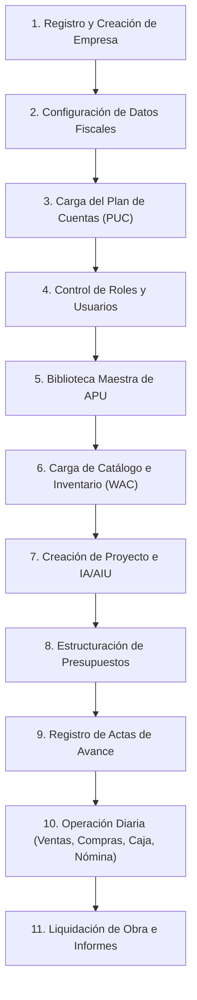

# MANUAL DE USUARIO — ERP INGENIERÍA CIVIL (COLOMBIA)

Bienvenido al manual oficial de usuario de la plataforma **ERP Ingeniería Civil**. Este sistema multi-tenant está diseñado específicamente para constructoras y empresas de obras civiles en Colombia. Permite gestionar desde la contabilidad bajo el Plan Único de Cuentas (PUC) hasta el control de proyectos con AIU, análisis de precios unitarios (APU), actas de avance de obra, nómina con legislación CST y extracción de facturas con Inteligencia Artificial.

---

## 🗺️ Mapa de Flujo de Trabajo Inicial

Para configurar correctamente la plataforma, es fundamental seguir este orden secuencial. Esto garantiza que todos los módulos tengan la información base (cuentas contables, APU, insumos, etc.) necesaria para funcionar de manera integrada:



---

## 🏢 1. Registro y Configuración Inicial

### Registro del Tenant (Empresa)
Al ingresar al sistema por primera vez, el primer paso es registrar tu empresa y la cuenta del administrador principal:
1. Dirígete a la vista de **Registro** (`/register`).
2. Completa los datos de la empresa:
   * **Nombre de la Empresa** (ej. *Construcciones Andinas S.A.S.*)
   * **Slug** (un identificador único en minúsculas sin espacios, ej. `construcciones-andinas`).
   * **Plan de Suscripción** (ej. *Pro*).
3. Configura los datos del **Usuario Administrador**:
   * Correo electrónico.
   * Contraseña (mínimo 8 caracteres, letras y números).
   * Nombres y Apellidos.
4. Al hacer clic en **Registrar**, el sistema creará tu entorno exclusivo (*Tenant*) de manera aislada y te redirigirá al Login.

### Configuración del Perfil de la Empresa
Una vez dentro de la plataforma:
1. Ve a **Configuración** (ícono de engranaje o menú de Ajustes).
2. En la pestaña de **Detalles del Tenant**, completa la información tributaria y financiera clave para las facturas y actas:
   * **NIT (Tax ID):** NIT colombiano incluyendo dígito de verificación (ej. `901.456.789-1`).
   * **Cuenta Bancaria:** Número de cuenta de la empresa.
   * **Tipo de Cuenta:** Ahorros o Corriente.
   * **Email de Facturación:** Dirección a donde llegarán las facturas de cobro.

---

## 📊 2. Módulo de Contabilidad e Impuestos

El ERP tiene un motor contable integrado basado en partida doble y alineado con las normas contables colombianas.

### 2.1. Plan Único de Cuentas (PUC)
Antes de facturar, comprar o pagar nómina, debes configurar tu Plan de Cuentas:
* **Carga Automática (Recomendada):** El sistema permite sembrar el PUC estándar colombiano para construcción mediante un botón de inicialización rápida en la pestaña **Contabilidad > Cuentas**.
* **Creación Manual:** Si deseas añadir una cuenta específica:
  1. Ve a **Contabilidad > Cuentas** y haz clic en **Nueva Cuenta**.
  2. Ingresa el **Código Contable** (ej. `110505` para Caja General, `111005` para Bancos).
  3. Ingresa el **Nombre de la Cuenta** y selecciona el **Tipo de Cuenta**:
     * **ASSET (Activo):** Cuentas de efectivo, bancos, inventario, clientes por cobrar.
     * **LIABILITY (Pasivo):** Proveedores, retenciones por pagar, obligaciones bancarias.
     * **EQUITY (Patrimonio):** Capital social, utilidades.
     * **REVENUE (Ingreso):** Ingresos por construcción, AIU.
     * **EXPENSE (Gasto):** Gastos de administración, compras de materiales directos, nómina.

### 2.2. Comprobantes de Diario (Asientos Contables)
Para registrar transacciones manuales (depreciaciones, ajustes, traslados bancarios):
1. Ve a **Contabilidad > Asientos**.
2. Haz clic en **Crear Asiento Contable**.
3. Indica la **Referencia** (ej. `ADJ-2026-001`), **Fecha** y **Descripción**.
4. Añade líneas de asiento contable:
   * Selecciona la **Cuenta Contable**.
   * Escribe el detalle de la línea.
   * Asigna el valor en **Débito** o **Crédito**.
5. **Regla de Oro:** El total de Débitos debe ser exactamente igual al total de Créditos. El sistema impedirá guardar el asiento si no está balanceado.
6. Guarda como **Borrador (Draft)** para revisión o selecciona **Publicar (Posted)** para afectar directamente los libros contables.

### 2.3. Balance de Comprobación e Informes
1. Ingresa a **Contabilidad > Balance de Comprobación** (Trial Balance).
2. Filtra por rango de fechas deseado.
3. El sistema listará todas las cuentas activas con su **Saldo Inicial**, **Movimientos Débito/Crédito** del período y su **Saldo Final**.
4. Puedes descargar este balance para exportarlo a tu software contable principal o enviarlo a la revisoría fiscal.

### 2.4. Impuestos y Obligaciones Fiscales
En la sección de **Impuestos**, el sistema centraliza la liquidación y control de las obligaciones fiscales colombianas:
* **Tipos de Impuesto:** IVA, Retención en la fuente (ReteFuente), ReteICA, Impuesto de Renta, ICA y Gravamen a los Movimientos Financieros (GMF/4x1000).
* **Gestión:** El sistema genera registros de las obligaciones con su base, tarifa, valor calculado, fecha de vencimiento y estado (Pendiente / Pagado / Vencido). Al marcarse como pagado, permite vincular la cuenta bancaria de salida y genera el asiento contable correspondiente de forma automática.

---

## 🛠️ 3. Biblioteca Maestra de APU

El **Análisis de Precios Unitarios (APU)** es el corazón de la presupuestación de obras civiles en Colombia. Define cuánto cuesta construir una unidad de medida (m², m³, kg, ml) de un ítem de obra específico.

```
FÓRMULA DE COSTO UNITARIO APU:
Costo Unitario Total = Costo Materiales + (Costo Mano de Obra × Factor Prestacional) + Costo Equipos
```

### 3.1. Capítulos de APU
Primero, organiza tu biblioteca maestra por capítulos de obra:
1. Ve a **Biblioteca APU > Capítulos**.
2. Registra los códigos y nombres de capítulo (ej. `01` - Preliminares, `02` - Excavaciones, `03` - Estructura).

### 3.2. Creación del Ítem de APU
1. Ve a **Biblioteca APU > Ítems** y selecciona **Crear Ítem**.
2. Completa los datos iniciales:
   * **Código:** Código interno de obra (ej. `APU-EST-01`).
   * **Nombre:** (ej. *Concreto para columnas 3000 PSI*).
   * **Unidad de Medida:** Unidad de obra (ej. `m³`).
   * **Factor Prestacional (Labor Factor):** Multiplicador para cubrir la carga prestacional colombiana del personal de obra (por defecto `1.60` o 160%, que representa las prestaciones, seguridad social y parafiscales).
3. **Agregar Insumos (Detalle del APU):**
   Añade los recursos que componen el ítem en tres categorías principales:
   * **Materiales:** Escribe la descripción (ej. *Cemento gris saco 50kg*), la unidad (ej. *Saco*), cantidad por unidad de obra (ej. *7.0*) y costo unitario.
   * **Mano de Obra:** Define las cuadrillas necesarias (ej. *Oficial de construcción*, *Ayudante*), el rendimiento en horas y el costo por hora. *Nota: El sistema multiplicará este costo por el Factor Prestacional configurado.*
   * **Equipos / Herramientas:** Registra la maquinaria o herramienta menor (ej. *Mezcladora de concreto*, *Vibrador*), rendimiento y costo horario.
4. El sistema sumará de manera automática los subtotales para mostrarte el **Costo Unitario Total del APU**. Guarda el ítem para tenerlo disponible al estructurar presupuestos de cualquier proyecto.

---

## 📦 4. Módulo de Inventario

Gestiona el almacenamiento físico de tus materiales mediante el método de **Costo Promedio Ponderado (WAC - Weighted Average Cost)**:

### 4.1. Catálogo de Artículos
1. Ve a **Inventario > Artículos**.
2. Crea artículos especificando si son:
   * **PRODUCT (Producto):** Artículos que se almacenan (ej. *Varilla corrugada de 1/2"*).
   * **SERVICE (Servicio):** Ítems intangibles (ej. *Consultoría*, *Transporte*).
   * **RAW_MATERIAL (Materia Prima):** Elementos básicos de construcción.
3. Define la unidad de medida, precio de venta predeterminado y punto de reorden (stock mínimo que dispara una alerta de compra).

### 4.2. Transacciones de Inventario
* **ENTRADA (Entry):** Registra el ingreso de mercancías. Requiere la cantidad de unidades y el costo unitario de compra. **Esto recalcula automáticamente el Costo Unitario Promedio (WAC) del producto en el sistema.**
* **SALIDA (Exit):** Registra el consumo de materiales en obra o el despacho a clientes. Descuenta las unidades del inventario utilizando el costo promedio ponderado vigente al momento de la salida (el WAC se mantiene intacto en salidas).

---

## 🏗️ 5. Gestión de Proyectos y Presupuesto Oficial con AIU

### 5.1. Crear un Proyecto
1. Dirígete a **Proyectos > Crear Proyecto**.
2. Diligencia los datos básicos:
   * **Código de Proyecto:** Identificador único (ej. `PRY-AEROPUERTO`).
   * **Nombre:** ej. *Pavimentación Pista de Aterrizaje*.
   * **Ubicación** y **Cliente**.
   * **Valor Base del Contrato:** Monto de costos directos acordado.
3. **Configuración de AIU (Administración, Imprevistos y Utilidad):**
   Las obras en Colombia se contratan habitualmente desglosando el AIU. En la ficha de creación, define los porcentajes correspondientes (en formato decimal):
   * **Administración (Admin Pct):** Costos de personal directivo, oficinas de obra, etc. (ej. `0.10` para 10%).
   * **Imprevistos (Risk Pct):** Margen para imprevistos geológicos o climáticos (ej. `0.05` para 5%).
   * **Utilidad (Profit Pct):** Margen de ganancia neto de la constructora (ej. `0.05` para 5%).
4. El sistema calculará automáticamente los montos y el **Valor Total del Contrato** sumando el Costo Directo + los tres componentes del AIU.

### 5.2. Crear el Presupuesto Oficial (Línea Base)
Un proyecto puede tener varias versiones de presupuesto. Para crear la versión activa:
1. Ve al proyecto y haz clic en **Nuevo Presupuesto**.
2. Crea los capítulos específicos del presupuesto del proyecto.
3. Añade **Líneas de Presupuesto**:
   * Puedes traer directamente un ítem desde la **Biblioteca de APU** maestra.
   * Define la **Cantidad Presupuestada** para la obra.
   * El costo unitario se cargará desde el APU. El sistema multiplicará la cantidad por el costo unitario del APU para estimar el costo total directo del renglón.
4. Una vez estructurado el presupuesto completo, selecciona el estado **Aprobado**. Esto congelará la línea base y la preparará para el cobro de actas de avance.

---

## 🧾 6. Actas de Avance de Obra (Valuaciones)

El cobro de los proyectos de construcción se realiza mediante actas de avance periódicas, las cuales relacionan las cantidades físicas realmente ejecutadas durante un corte.

### Paso a paso para crear un Acta:
1. Ve al módulo **Actas de Avance > Nueva Acta**.
2. Asocia el **Proyecto** y el **Presupuesto Oficial Aprobado**.
3. Indica el número de acta (el sistema lleva el control secuencial: Acta 1, Acta 2, etc.) y la fecha de corte.
4. Define el porcentaje de **Retención de Garantía (normalmente entre 5% y 10%)**:
   * *La retención es un porcentaje de dinero que el cliente retiene de cada acta para asegurar que la obra finalice correctamente o para cubrir reparaciones menores.*
5. **Cargar Cantidades Ejecutadas:**
   El sistema desplegará la lista de ítems aprobados en el presupuesto. Para cada ítem, verás:
   * Cantidad Total Presupuestada.
   * Cantidad Acumulada Anterior (calculada automáticamente de actas previas).
   * **Cantidad Ejecutada en este Período (Campo a diligenciar por el usuario).**
   * El sistema calcula de inmediato la nueva *Cantidad Acumulada Actual* y el *Porcentaje de Ejecución*.
6. **Cálculos Financieros Automáticos del Acta:**
   * **Valor Bruto (Gross Amount):** Sumatoria de las cantidades ejecutadas en el período multiplicadas por el costo unitario del presupuesto oficial.
   * **Retención de Garantía (Retention Amount):** El valor a descontar en esta acta (ej. `Valor Bruto × 5%`).
   * **Valor Neto a Pagar (Net Amount):** Monto final que se cobrará al cliente (`Valor Bruto − Retención de Garantía`).
7. Guarda y aprueba el acta. Puedes descargar el **reporte en PDF del Acta de Avance** con el formato de firmas de interventoría y desglose de cantidades acumuladas.

---

## 💵 7. Facturación, Compras y Caja Menor

### 7.1. Ventas y Clientes
Para cobrar las actas de avance o vender materiales independientes:
1. Registra tus **Clientes** en la pestaña correspondiente (con NIT, dirección y datos de contacto).
2. Ve a **Facturas de Venta (Invoices) > Nueva Factura**.
3. Diligencia el número de factura, cliente y fecha de vencimiento.
4. Agrega los ítems vendidos o el cobro por concepto de avance de obra.
5. Selecciona las cuentas contables de contrapartida para la automatización:
   * **Cuenta por Cobrar (CxC - AR Account):** ej. `130505` (Clientes Nacionales).
   * **Cuenta de Ingresos (Revenue Account):** ej. `4100` (Ingresos por Construcción).
   * **Cuenta de Impuestos (Tax Account):** ej. `2408` (IVA por Pagar).
6. **Emisión de la Factura:** Al presionar **Emitir (Issue)**:
   * La factura pasa de `DRAFT` a `ISSUED` y ya no se puede modificar.
   * Se descuenta el stock de inventario en caso de incluir productos tangibles.
   * **Se genera automáticamente el asiento contable** (Débito a CxC, Crédito a Ingresos, Crédito a IVA por Pagar), quedando contabilizada en tiempo real.

### 7.2. Compras a Proveedores e Inteligencia Artificial (OCR)
1. Registra tus **Proveedores** (con su NIT de facturación).
2. **Factura de Proveedor Manual:** Ingresa a **Compras > Facturas de Proveedor**, escribe el número de factura física, subtotal, porcentaje de retención en la fuente practicado y asocia las cuentas contables de gasto y proveedores.
3. **Módulo de Extracción IA (OCR):**
   Si recibes una factura en formato de texto plano o PDF escaneado (OCR):
   * Ve al menú **IA Factura OCR**.
   * Pega el texto extraído del documento (ej. *"Proveedor: Acero S.A.S, NIT: 800111222, Factura No: F-556, Subtotal: $1.000.000, IVA 19%: $190.000, Total: $1.190.000"*).
   * Selecciona la cuenta de gasto donde deseas registrarlo (ej. `5195` - Gastos de Construcción) y la cuenta de proveedores (`2205`).
   * Haz clic en **Analizar con IA**. La plataforma utilizará la **API de Claude** para procesar la información de forma semántica, verificar las matemáticas y crear un **Borrador de Asiento Contable** de forma automática en tu contabilidad, listo para aprobación.

### 7.3. Recibos de Caja y Comprobantes de Egreso
* **Recibo de Caja (Cash Receipt):** Registra los dineros recibidos de clientes. Puede asociarse a una factura de venta (cambiando su estado a `PAID`) o registrarse de forma directa como un ingreso de caja general (`110505`).
* **Comprobante de Egreso / Pagos (Vendor Payment):** Registra la salida de dinero para pagar facturas de compras pendientes. Genera de forma automática el asiento débito a proveedores (`2205`) y crédito a la cuenta bancaria de salida (`111005`).

### 7.4. Caja Menor (Petty Cash) por Proyecto
Las obras tienen gastos menores cotidianos (peajes, almuerzos de personal, ferretería express) que no pasan por facturación formal inmediata:
1. Crea un fondo en **Caja Menor > Crear Caja Menor**. Asóciala a un **Proyecto**, define un responsable de caja y un **Saldo Inicial** en efectivo.
2. Cada vez que el responsable realice un gasto menor, regístralo en **Registrar Transacción de Caja Menor**, seleccionando la categoría correspondiente:
   * `TRANSPORT` (Transportes y peajes)
   * `SUPPLIES` (Papelería y aseo)
   * `FOOD` (Alimentación)
   * `COMMUNICATION` (Llamadas, internet)
   * `TOOLS` (Herramientas menores)
   * `OTHER` (Otros gastos)
3. El sistema descontará el dinero en tiempo real del saldo disponible de la caja del proyecto y mantendrá la trazabilidad para los reembolsos de caja periódicos.

---

## 👥 8. Módulo de Nómina y Carga Social (CST Colombia)

El cálculo del costo de personal de construcción en Colombia debe considerar el salario base más toda la carga prestacional y de seguridad social patronal dispuesta por el Código Sustantivo del Trabajo (CST).

### 8.1. Registro de Empleados
1. Ingresa a **Nómina > Empleados > Crear Empleado**.
2. Completa los datos personales y contractuales clave:
   * **Tipo de Contrato:** Fijo, Indefinido, Obra o Labor (muy común en construcción), Aprendizaje SENA.
   * **Salario Mensual Base (COP)**.
   * **Auxilio de Transporte:** Actívalo si el salario base es igual o inferior a 2 salarios mínimos legales vigentes (SMMLV).
   * **Nivel de Riesgo ARL (Clase I a V):** Fundamental para el personal operativo de obra civil (ej. *Clase V para alturas/riesgo máximo*).
   * **Entidades:** Registra su EPS, Fondo de Pensiones, Caja de Compensación y Cuenta Bancaria de Nómina.

### 8.2. Liquidación del Periodo de Nómina
1. Ve a **Nómina > Periodos** y selecciona **Generar Nómina**.
2. Selecciona el año, mes y la fracción (Mensual completo, 1ra Quincena, 2da Quincena).
3. El sistema cargará a los empleados activos. Puedes ingresar las novedades del mes:
   * Horas extras diurnas (HED - recargo 25%).
   * Horas extras nocturnas (HEN - recargo 75%).
   * Horas extras festivas diurnas (HEDF - recargo 75%).
   * Horas extras festivas nocturnas (HEDFC - recargo 100%).
   * Bonificaciones extralegales u otros devengados.
4. **Cálculos que realiza el sistema automáticamente:**
   * **Devengado:** Salario proporcional a días laborados + Auxilio de transporte legal + Recargos de horas extras + Bonos.
   * **Deducciones del Trabajador:** Descuento de Salud (4% de IBC) + Descuento de Pensión (4% de IBC) + Retención en la fuente si aplica.
   * **Neto a Pagar:** El dinero neto que se le transferirá al empleado.
   * **Provisiones de Prestaciones Sociales (Costo de la Empresa):**
     * Prima de Servicios (8.33% mensual).
     * Cesantías (8.33% mensual).
     * Intereses sobre Cesantías (1% mensual sobre las cesantías).
     * Vacaciones (4.17% mensual).
   * **Aportes Patronales (Seguridad Social y Parafiscales):**
     * Pensión Empleador (12%).
     * Salud Empleador (8.5% si el trabajador devenga más de 10 SMMLV).
     * ARL (tarifa porcentual según el nivel de riesgo I a V configurado en el empleado).
     * Caja de Compensación Familiar (4%).
     * SENA (2%) e ICBF (3%) si aplica.
5. El sistema consolidará todo en el indicador **Costo Total del Trabajador** (Neto a pagar + Prestaciones + Aportes).
6. Aprueba el periodo y podrás descargar la **Colilla de Pago en PDF** individual para cada empleado.

---

## 🏁 9. Liquidación Final de Proyectos

Al finalizar un proyecto de construcción, se procede al cierre administrativo y financiero mediante el acta de liquidación de contrato:

1. Ve a **Proyectos > Liquidaciones > Crear Liquidación**.
2. Selecciona el **Proyecto** y su **Presupuesto Oficial**.
3. El sistema calculará el consolidado financiero en tiempo real:
   * **Valor Total de Contrato:** Sumatoria de presupuesto base + adiciones de valor autorizadas.
   * **Total Ejecutado:** Sumatoria de todas las Actas de Avance aprobadas y pagadas.
   * **Total Retenido:** Acumulado de la Retención de Garantía practicada en todas las actas de avance.
4. **Agregar Deducciones de Cierre:**
   Registra los descuentos que se le aplicarán al contratista en el balance final:
   * Descuento de Anticipos recibidos no amortizados.
   * Multas por retrasos de obra.
   * Retenciones adicionales en la fuente de impuestos (ReteFuente, ReteICA).
5. **Cálculo del Saldo Neto:** El sistema calcula el saldo final neto a pagar o cobrar mediante la fórmula:
   $$\text{Saldo Neto} = \text{Total Ejecutado} - \text{Total Retenido} - \text{Total Deducciones}$$
6. Al cambiar el estado a **Final**, se congela el proyecto y se genera la **Certificación de Liquidación en PDF** que sirve como soporte legal de cierre de obra para el cliente y la constructora.

---

## 🔍 10. Módulo SECOP II (Licitaciones Públicas)

La plataforma incluye un buscador directo integrado con la API de **Colombia Compra Eficiente (SECOP II)** para facilitar la búsqueda de nuevas oportunidades de licitación en obras públicas:
1. Dirígete al menú **SECOP II**.
2. Escribe una palabra clave (ej. *Pavimentación*, *Alcantarillado*, *Interventoría*).
3. Selecciona la entidad pública contratante o filtra por departamento si es necesario.
4. El sistema listará en tiempo real los procesos de contratación abierta, mostrando:
   * Nombre de la Entidad.
   * Descripción del Objeto contractual.
   * Valor del Proceso.
   * Estado de la licitación y enlace directo al SECOP II para descargar los pliegos de condiciones y participar.
